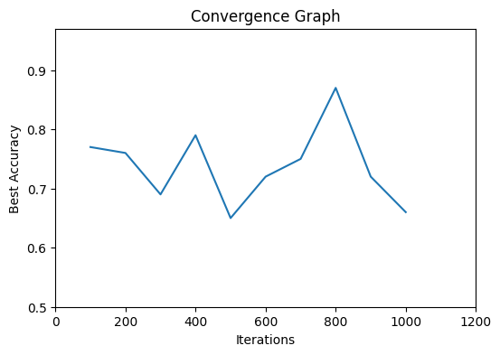

# Parameter Optimization of SVM for Multi-Class Classification

## Methodology

### 1. Importing Libraries
- Used pandas, numpy, seaborn, and scikit-learn libraries for data manipulation, visualization, and model building.
- Imported necessary modules for Support Vector Machine (SVM) from scikit-learn.

### 2. Data Exploration and Pre-processing
- Loaded the dataset using pandas `read_excel` function.
- Encoded categorical labels using `LabelEncoder`.
- Standardized feature values using `StandardScaler`.

### 3. Support Vector Machine
- Initialized SVM with different kernels: linear, polynomial, radial basis function (RBF), and sigmoid.
- Implemented a fitness function to evaluate SVM models based on accuracy.
- Conducted parameter optimization using a random search approach.
- Iterated over multiple train-test splits to reduce bias in results.

### 4. Convergence Graph
- Plotted a convergence graph to visualize the improvement in accuracy over iterations.
- Set x-axis as the number of iterations and y-axis as the best accuracy achieved.

## Results

- The optimization process resulted in the selection of the best parameters for each train-test split.
- Results were saved in a DataFrame and exported to a CSV file named `result.csv`.
- A convergence graph was generated to illustrate the improvement in accuracy over iterations.
- The graph was saved as `t.png` for reference.
  

## Future Improvements

- Consider using more advanced parameter optimization techniques like grid search or Bayesian optimization for better results.
- Implement cross-validation to obtain more robust estimates of model performance.
- Explore different evaluation metrics beyond accuracy for a deeper understanding of model performance.

## Conclusion

This project demonstrates the methodology and results of parameter optimization for SVM in multi-class classification tasks. The provided code can serve as a foundation for further experimentation and improvement in machine learning projects.
